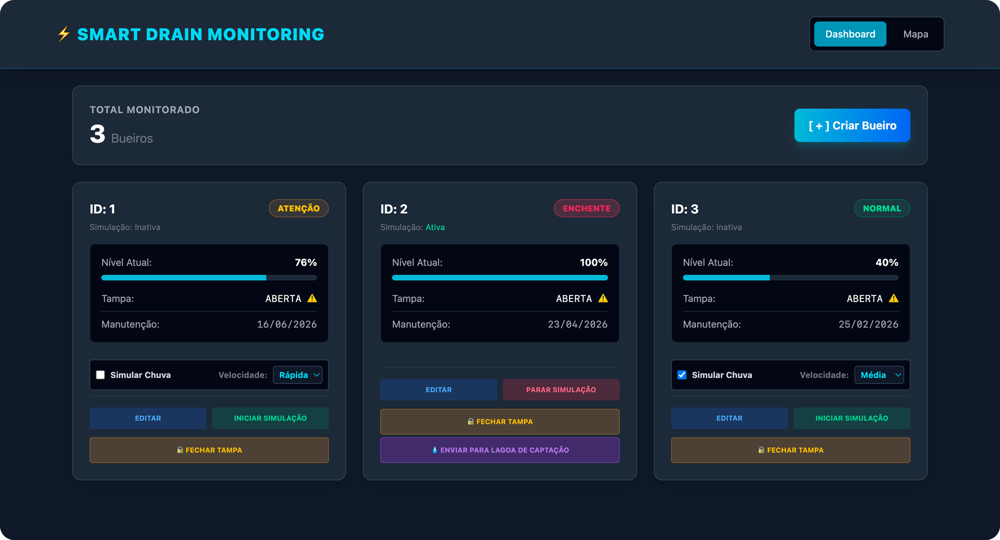
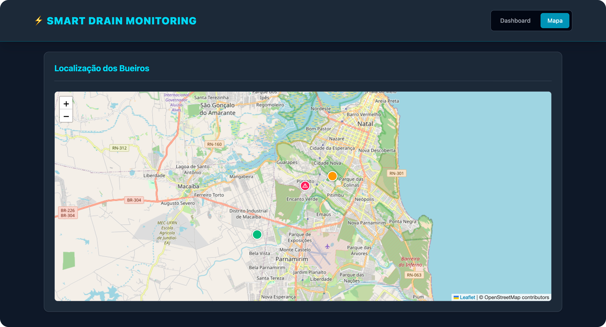
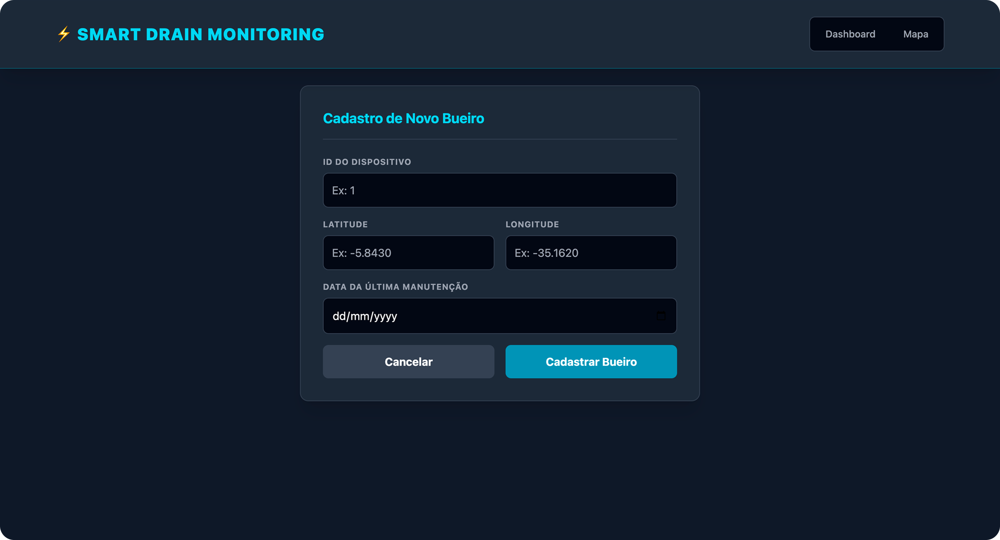
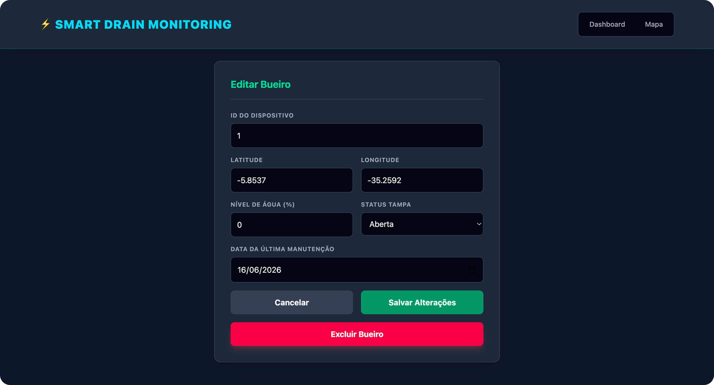

# Smart Drain Monitoring (FIWARE + Node.js)

Este é um projeto Full Stack (Node.js + Express + TailwindCSS) para o monitoramento inteligente de bueiros utilizando o ecossistema **FIWARE**. A aplicação realiza o provisionamento automático de componentes, registra novos bueiros via IoT Agent (JSON over HTTP), gerencia o Context Broker (Orion), assina a persistência temporal (QuantumLeap) e monitora tudo em tempo real através de um Dashboard interativo com simulador de chuva.

## 1. Funcionalidades

### 1.1. Dashboard e Visualização

* Painel principal com a contagem total de bueiros monitorados no sistema.
* Visualização em tempo real do status de cada bueiro através de *cards*, exibindo o nível de água (em barra de progresso e porcentagem), status da tampa (aberta ou fechada) e data da última manutenção.
* Sistema de alertas visuais dinâmicos nos *cards*, categorizados pelo nível da água: Normal, Atenção, Risco de Enchente e Enchente (com animação pulsante).
* Aba com Mapa interativo (via Leaflet) exibindo a localização geográfica dos bueiros monitorados.
* Marcadores no mapa com cores indicativas do nível da água (verde, laranja ou vermelho) e animação de alerta quando a tampa do bueiro encontra-se aberta.
* Consulta do histórico temporal de alterações e telemetria do bueiro através de integração com o banco de dados.

### 1.2. Gestão de Dispositivos (CRUD)

* Cadastro de novos bueiros com informações de ID, Latitude, Longitude e Data da última manutenção.
* Validação geográfica restritiva, garantindo que as coordenadas cadastradas pertençam aos limites de Natal/RN.
* Prevenção de duplicidade de ID no momento do cadastro e edição.
* Edição de informações de bueiros existentes, permitindo também a alteração manual do nível da água e do status da tampa.
* Bloqueio de datas futuras no calendário ao informar a data de manutenção.
* Exclusão permanente de um bueiro, removendo-o do banco de dados e limpando suas simulações ativas.

### 1.3. Controle Remoto e Operação

* Botão para fechamento remoto da tampa ("Fechar Tampa") quando o sistema detecta que ela está aberta.
* Mecanismo de segurança (*cooldown*): após um comando manual de fechar a tampa, o sistema impede aberturas acidentais ou simuladas por um período de 5 minutos.
* Botão de emergência ("Enviar para Lagoa de Captação") que aparece exclusivamente quando o nível de água atinge 100%.
* Sistema de escoamento (drenagem) progressivo em segundo plano, que reduz o nível da água do bueiro alagado de forma agressiva até estabilizar na cota de segurança de 40%.

### 1.4. Motor de Simulação Automática

* Início e parada rápida da simulação individual por bueiro diretamente pelo *card*.
* Formulário de configuração de simulação, permitindo definir se haverá fluxo de chuva constante ou não.
* Configuração da velocidade de atualização da simulação: Lenta (4 segundos), Média (2 segundos) ou Rápida (1 segundo).
* Simulação climática: com chuva, o nível da água sobe progressivamente; sem chuva, o nível desce de forma natural.
* Simulação de imprevistos: a tampa possui uma pequena probabilidade de abrir sozinha aleatoriamente durante os ciclos, simulando incidentes urbanos.
* Salvamento automático das configurações de simulação (velocidade e chuva) na memória local do navegador (localStorage).

### 1.5. Infraestrutura e Backend Integrado

* Auto-provisionamento: na inicialização, o servidor Node.js configura automaticamente os serviços e inscrições (*Subscriptions*) necessárias no ecossistema FIWARE.
* Limpeza automática de inscrições antigas no sistema para evitar conflitos.
* Integração direta de telemetria baseada em *JSON over HTTP* através do IoT Agent.
* Gerenciamento e distribuição de contexto centralizado pelo Orion Context Broker.
* Integração com QuantumLeap e CrateDB para a gravação contínua e persistência do histórico em banco de dados temporal.

## 2. Interfaces

### 2.1. Monitoramento de Bueiros



### 2.2. Localização de Bueiros



### 2.3. Criar Bueiro



### 2.4. Editar e Excluir Bueiro



## 3. Motor de Simulação

O projeto possui um motor interno no backend que simula o comportamento físico dos bueiros em tempo real. Ele altera variáveis de telemetria, como o nível da água e o estado da tampa, com base em diferentes parâmetros enviados pelo usuário.

### 3.1. Velocidades de Simulação

A velocidade dita a frequência (intervalo) com que o servidor processa a física do bueiro e envia novas telemetrias para o IoT Agent do FIWARE. As opções disponíveis na rota `/api/simulate/auto/start` são:

* **Lenta (`speed: "lenta"`):** O ciclo de atualização ocorre a cada 4 segundos (4000ms).
* **Média (`speed: "media"` ou valor padrão se omitido):** O ciclo ocorre a cada 2 segundos (2000ms).
* **Rápida (`speed: "rapida"`):** O ciclo ocorre a cada 1 segundo (1000ms).

### 3.2. Cenários Climáticos (Nível da Água)

A propriedade `simulateRain` determina a progressão do alagamento do bueiro ao longo dos ciclos de simulação:

* **Com Chuva (`simulateRain: true`):** Simula precipitação contínua. O nível da água não desce; pelo contrário, recebe um incremento randômico entre +2 e +9 pontos a cada ciclo, alagando rapidamente até encontrar o limite máximo de 100%.
* **Sem Chuva / Normal (`simulateRain: false`):** Simula o tempo firme. O nível de água sofre uma oscilação natural para baixo, subtraindo randômicamente de -1 a -4 pontos a cada ciclo até secar totalmente e estabilizar em 0%.

### 3.3. Escoamento / Lagoa de Captação (Drenagem)

A função de esvaziamento de emergência (`/api/devices/:deviceId/drain`) sobrepõe as simulações climáticas atuais para escoar o bueiro em direção à lagoa de captação ou galeria pluvial principal:

* **Redução Agressiva:** Independentemente do tempo de simulação, enquanto estiver em drenagem, o bueiro perde continuamente 8 pontos de nível de água por ciclo.
* **Nível Seguro:** A drenagem não esvazia o bueiro até 0%. Ela cessa automaticamente assim que o nível da água chega à cota de segurança de 40%.
* **Fim da Tempestade:** Se o bueiro estiver sob efeito contínuo de Chuva (`simulateRain: true`), ao final do processo de drenagem o sistema interpretará que a tempestade passou e mudará o comportamento para Sem Chuva (`simulateRain: false`), normalizando o sistema.

### 3.4. Comportamento Aleatório da Tampa e Cooldown

A simulação inclui imprevistos urbanos:

* **Abertura Acidental:** Se a tampa de um bueiro monitorado estiver fechada (`closed`), existe uma chance aproximada de **8%** em cada ciclo da tampa se abrir espontaneamente (`open`), simulando o deslocamento por força da água ou furtos.
* **Mecanismo de Cooldown:** Para permitir manutenções efetivas pelo Dashboard, quando um comando manual de fechamento de tampa (`/close-cover`) é emitido, a simulação daquele bueiro entra em estado de *cooldown* (descanso) de **5 minutos** (300.000ms). Durante esta janela, a tampa estará protegida contra aberturas acidentais.

## 4. Pré-requisitos

Antes de começar, certifique-se de ter instalado em sua máquina:

* **Docker** e **Docker Compose**
* **Node.js** (versão 18 ou superior)
* **NPM** (gerenciador de pacotes do Node)

## 5. Como Executar o Projeto

Siga os passos abaixo no terminal para rodar a aplicação:

### 5.1. Iniciar a Infraestrutura FIWARE (Docker)

Suba todos os containers necessários (Orion, IoT Agent, MongoDB, CrateDB, QuantumLeap e Grafana) em segundo plano:

```bash
docker compose up -d
```

### 5.2. Verificar o Status dos Containers

Garanta que todos os serviços estão de pé e rodando corretamente:

```bash
docker ps
```

### 5.3. Instalar as Dependências do Node.js

Se for a primeira vez rodando o projeto, instale os pacotes necessários:

```bash
npm install
```

### 5.4. Iniciar o Servidor Backend e Frontend

Inicie a aplicação Node.js. O próprio servidor se encarregará de fazer o *provisionamento inicial* (Service Group e Subscription) no FIWARE após 3 segundos:

```bash
npm start
```

## 6. Acesso à Aplicação

Assim que o servidor iniciar com sucesso, abra o seu navegador e acesse:

```text
http://localhost:3080
```

## 7. Portas da Aplicação e Serviços

Abaixo estão as portas utilizadas pelos serviços na arquitetura e suas respectivas funções:

* **Backend/Frontend (Node.js) - Porta `3080`:** Responsável por servir a interface web (Dashboard) e processar as requisições da API interna da aplicação.

* **FIWARE Orion (Context Broker) - Porta `1026`:** Centralizador de contexto do FIWARE. Armazena e gerencia o estado atual em tempo real de cada bueiro.

* **IoT Agent JSON (North Port) - Porta `4041`:** Interface voltada para administração e gerenciamento. Utilizada para o provisionamento de novos dispositivos e configurações de serviços.

* **IoT Agent JSON (HTTP Port) - Porta `7896`:** Interface voltada para a recepção de dados (sul). É por onde os sensores enviam as telemetrias e dados brutos via JSON sobre HTTP.

* **QuantumLeap - Porta `8668`:** Serviço responsável por receber as notificações de mudança de contexto do Orion e convertê-las em dados históricos temporais.

* **CrateDB - Portas `4200` e `5432`:** Banco de dados relacional distribuído otimizado para séries temporais, utilizado pelo QuantumLeap para persistir o histórico do sistema.

* **MongoDB - Porta `27017`:** Banco de dados NoSQL utilizado internamente pelo Orion para salvar as entidades, metadados e inscrições atuais.

* **Chave de API - API Key `1234`:** O IoT Agent está configurado para utilizar essa chave de segurança na validação do fluxo de envio de dados.

## 8. Exemplos de Requisições via API (cURL)

Como navegadores realizam apenas requisições `GET` pela barra de endereços, utilize o seu terminal (via comandos `curl`) ou ferramentas como Postman e Insomnia para testar as rotas de criação, edição ou ação.

### 8.1. Listar todos os bueiros cadastrados

```bash
curl -X GET http://localhost:3080/api/devices
```

### 8.2. Buscar histórico temporal de um bueiro (QuantumLeap)

```bash
curl -X GET http://localhost:3080/api/devices/1/history
```

### 8.3. Cadastrar um novo bueiro

```bash
curl -X POST http://localhost:3080/api/devices \
-H "Content-Type: application/json" \
-d '{
  "deviceId": "1",
  "latitude": -5.8430,
  "longitude": -35.1620,
  "lastMaintenance": "2023-10-01"
}'
```

### 8.4. Atualizar os dados ou status de um bueiro

```bash
curl -X PUT http://localhost:3080/api/devices/1 \
-H "Content-Type: application/json" \
-d '{
  "deviceId": "1",
  "latitude": -5.8430,
  "longitude": -35.1620,
  "waterLevel": 45,
  "coverStatus": "open",
  "lastMaintenance": "2023-10-05"
}'
```

### 8.5. Fechar a tampa de um bueiro remotamente

```bash
curl -X POST http://localhost:3080/api/devices/1/close-cover
```

### 8.6. Iniciar esvaziamento de emergência (Drenagem)

```bash
curl -X POST http://localhost:3080/api/devices/1/drain
```

### 8.7. Iniciar simulação automática (Nível da água/Chuva)

*O parâmetro speed aceita: "lenta", "media" ou "rapida".*

```bash
curl -X POST http://localhost:3080/api/simulate/auto/start \
-H "Content-Type: application/json" \
-d '{
  "deviceId": "1",
  "simulateRain": true,
  "speed": "media"
}'
```

### 8.8. Parar a simulação automática

```bash
curl -X POST http://localhost:3080/api/simulate/auto/stop \
-H "Content-Type: application/json" \
-d '{
  "deviceId": "1"
}'
```

### 8.9. Excluir um bueiro permanentemente

```bash
curl -X DELETE http://localhost:3080/api/devices/1
```
